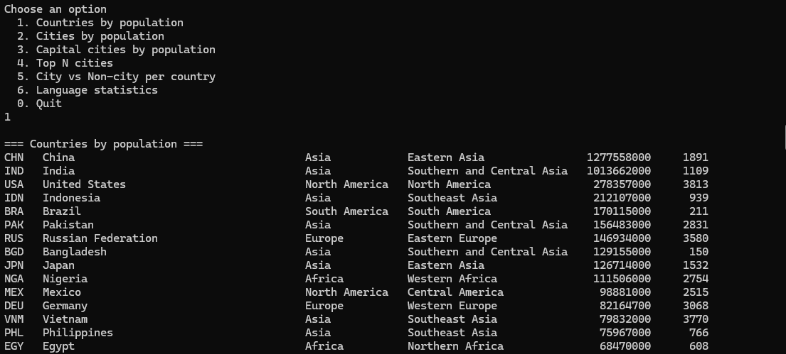
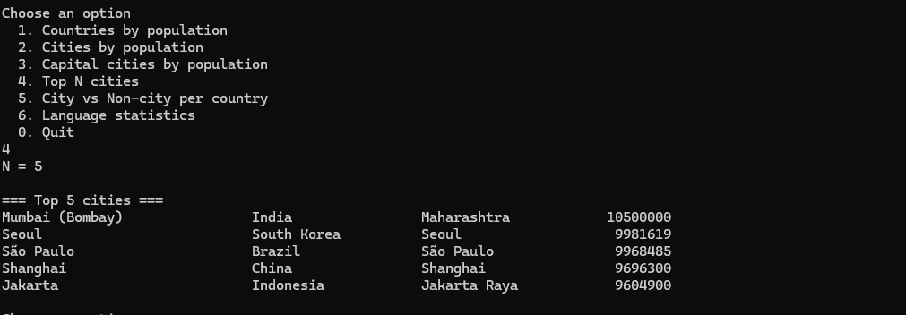
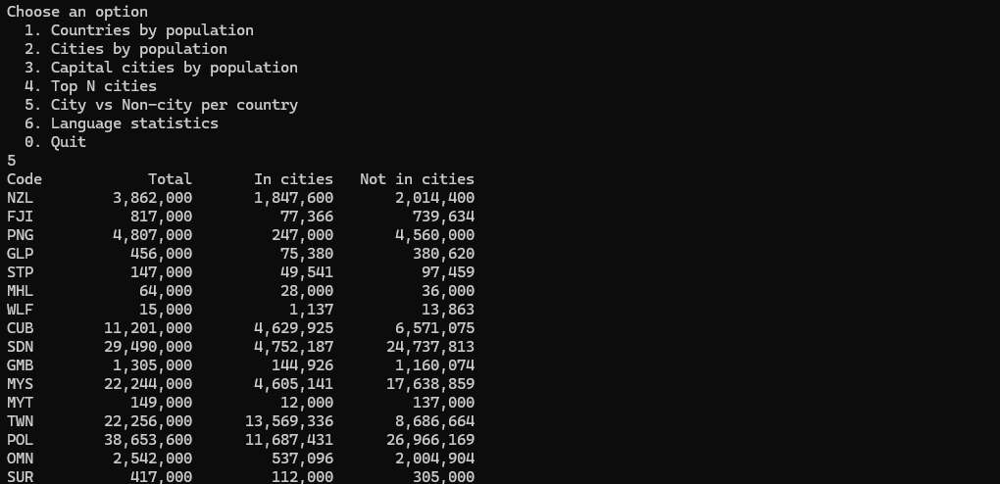
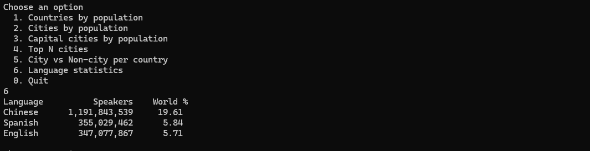

# Population Reports

A Java console application that connects to the MySQL "world" database and prints population and city reports.  
Supports both local (Eclipse) and Docker environments.

## 📊 Features

- Countries by population  
- Cities by population  
- Capital cities by population  
- Top N populous cities  
- City vs Non-city population by country  
- Language population statistics  

## 🔧 Technologies

- Java 21  
- Maven  
- MySQL  
- Docker  

## ⚙️ Configuration

Edit the file: `src/main/resources/application.properties`

db.url.local=jdbc:mysql://localhost:3306/world  
db.url.docker=jdbc:mysql://host.docker.internal:3306/world  
db.user=root  
db.pass=

The app uses db.url.local by default.  

If you run via Docker, it switches to db.url.docker when RUN_ENV=docker is passed.

## 🛠️ Build and Run

### ▶️ Local (Eclipse or CLI)

mvn clean compile exec:java

### 🐳 Docker

mvn clean package -DskipTests  
docker build -t population-reports:1.0 .  
docker run -e RUN_ENV=docker -it population-reports:1.0

## ✅ Requirements Table

ID | Name                          | Met | Screenshot  
---|-------------------------------|-----|--------------------------------------------------  
1  | Countries by population       | ✅  |   
2  | Cities by population          | ✅  |   
3  | Capital cities by population  | ✅  |   
4  | Top N cities                  | ✅  |   
5  | City vs Non-city by country   | ✅  |   
6  | Language stats                | ✅  |   
7  | Tests                         | ✅  | 

## 👤 Author

**Name:** Abdullah Arshad  
**Matriculation Number:** 40692321
