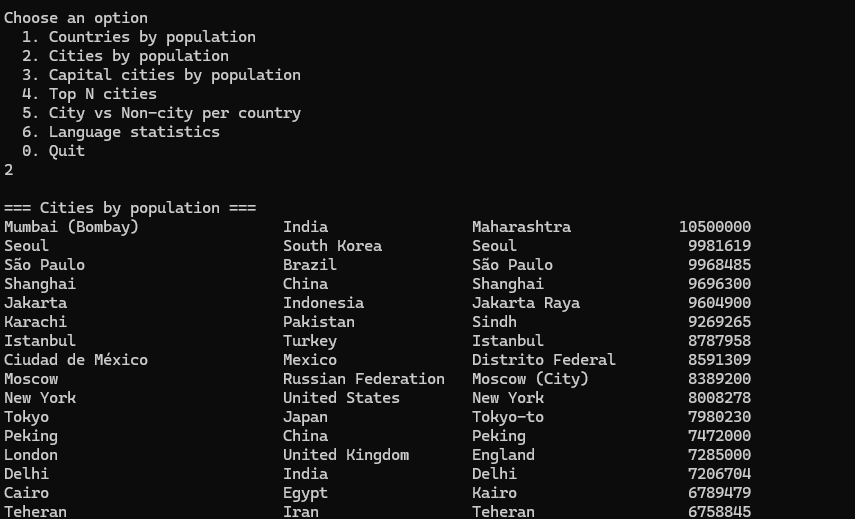
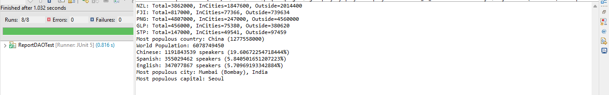

# Population Reports

A Java console application that connects to the MySQL "world" database and prints population and city reports. Supports both local (Eclipse) and Docker environments.

Features:
- Countries by population
- Cities by population
- Capital cities by population
- Top N populous cities
- City vs Non-city population by country
- Language population statistics

Technologies:
- Java 21
- Maven
- MySQL
- Docker

Configuration:
Edit the file: src/main/resources/application.properties

db.url.local=jdbc:mysql://localhost:3306/world
db.url.docker=jdbc:mysql://host.docker.internal:3306/world
db.user=root
db.pass=

The app uses db.url.local by default.
If you run via Docker, it switches to db.url.docker when RUN_ENV=docker is passed.

Build and Run:

Local (Eclipse or CLI):
mvn clean compile exec:java

Docker:
mvn clean package -DskipTests
docker build -t population-reports:1.0 .
docker run -e RUN_ENV=docker -it population-reports:1.0

Requirements Table:
ID | Name                         | Met | Screenshot
---|------------------------------|-----|------------
1  | Countries by population      | ✅  | 
2  | Cities by population         | ✅  | 
3  | Capital cities by population | ✅  | 
4  | Top N cities                 | ✅  | 
5  | City vs Non-city by country  | ✅  | 
6  | Language stats               | ✅  | 
7  | Tests                        | ✅  | 
